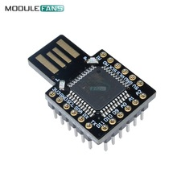

**Arduino Silly Keyboard** forked from  Arduino HID Project 2.4.4
=========================



This is targetted at the Leonardo or compatible boards (32U4) and will be built around one of these:
https://www.aliexpress.com/item/Beetle-Virtual-Keyboard-BadUSB-Pro-Micro-ATMEGA32U4-Module-Mini-Development-Expansion-Board-For-Arduino-Leonardo-R3/32847715254.html?spm=2114.search0104.3.1.7d542341ScymPz&ws_ab_test=searchweb0_0,searchweb201602_1_10152_10151_10065_10344_10068_10342_10343_10340_5722611_10341_10696_5722911_5722811_10084_5722711_10083_10618_10307_10134_5711211_10059_308_100031_10103_10624_10623_10622_10621_10620_5711311_5722511_10814_10815,searchweb201603_25,ppcSwitch_5&algo_expid=c50f562a-35a5-4cbe-9391-2b1586b8823e-0&algo_pvid=c50f562a-35a5-4cbe-9391-2b1586b8823e&priceBeautifyAB=0

It's going to act like a keyboard (HID) and will write random words at random times with the purpose of being an entertaining toy for the office to play (innocent) jokes on colleagues.

If I get clever, then it will insert words at just the right time when someone is typing - for example when the space bar is pressed and it's the perfect perfect time to insert a new new word word. Replay replay retyping things that were already typed would also be great. But I have some learning to do first! 

The project will advance more when the hardware arrives (sometime in the next 5-6 weeks).


Forked at
2.4.4 Release (27.01.2017)
* Added releaseAll() to Mouse API
* Fix flexible array errors


Licence and Copyright
=====================
Here's the original License conditions from NicoHood (AWESOME WORK!). 
```
Copyright (c) 2014-2016 NicoHood
See the readme for credit to other people.

Permission is hereby granted, free of charge, to any person obtaining a copy
of this software and associated documentation files (the "Software"), to deal
in the Software without restriction, including without limitation the rights
to use, copy, modify, merge, publish, distribute, sublicense, and/or sell
copies of the Software, and to permit persons to whom the Software is
furnished to do so, subject to the following conditions:

The above copyright notice and this permission notice shall be included in
all copies or substantial portions of the Software.

THE SOFTWARE IS PROVIDED "AS IS", WITHOUT WARRANTY OF ANY KIND, EXPRESS OR
IMPLIED, INCLUDING BUT NOT LIMITED TO THE WARRANTIES OF MERCHANTABILITY,
FITNESS FOR A PARTICULAR PURPOSE AND NONINFRINGEMENT. IN NO EVENT SHALL THE
AUTHORS OR COPYRIGHT HOLDERS BE LIABLE FOR ANY CLAIM, DAMAGES OR OTHER
LIABILITY, WHETHER IN AN ACTION OF CONTRACT, TORT OR OTHERWISE, ARISING FROM,
OUT OF OR IN CONNECTION WITH THE SOFTWARE OR THE USE OR OTHER DEALINGS IN
THE SOFTWARE.
```
